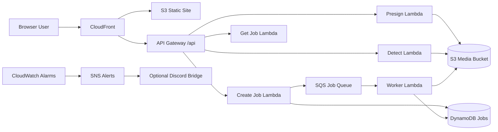

# Face Swap Running on Lambda

Serverless face swap service built around `inswapper_128.onnx`, AWS Lambda, S3 direct uploads, and a static frontend behind CloudFront.

## What this project demonstrates

- Serverless ML inference with a container-based Lambda workload
- Async job orchestration with API Gateway, SQS, DynamoDB, and S3
- Production-oriented observability with CloudWatch dashboards and alarms
- GitHub Actions deployment to AWS using GitHub OIDC instead of long-lived access keys

## Architecture



- Static frontend is served from S3 through CloudFront at `https://face-swap.aigyeom.com`
- API Gateway is mounted behind the same distribution under `/api/*`
- Browser uploads source and target images directly to S3 using presigned URLs
- Detect Lambda uses `buffalo_l` to find selectable faces
- Worker Lambda runs `inswapper_128.onnx` asynchronously from SQS and writes results back to S3
- DynamoDB stores job state and the frontend polls `GET /api/jobs/{jobId}` for completion

## Repository Layout

- `bin/`, `lib/`: AWS CDK application and infrastructure definitions
- `backend/api/`: Python API Lambdas for presign, job creation, and polling
- `backend/ml/`: containerized ML Lambda runtime and handlers
- `backend/ops/`: operational notifier Lambdas
- `frontend/`: static site assets

## Operations & Observability

- CloudWatch Dashboard tracks API traffic, error rates, Lambda durations, queue health, custom job metrics, and WAF blocked requests
- CloudWatch Alarms cover API `5XX`, worker errors, worker max duration, queue age, and DLQ visibility
- SNS is the central alarm topic
- Discord delivery is optional and enabled only when `DISCORD_WEBHOOK_SECRET_ARN` is configured through Secrets Manager
- API access logs are enabled at the API Gateway stage
- Backend handlers emit structured JSON logs with `service`, `jobId`, `stage`, `status`, `durationMs`, and `requestId`

## CI/CD

GitHub Actions is defined in `.github/workflows/pipeline.yml`.

- `pull_request`: `npm ci`, `npm run check`, `node --check frontend/app.js`, Python `py_compile`, optional `cdk synth`
- `push` on `main`: same validation, then automatic deploy with GitHub OIDC and `cdk deploy`

Required GitHub repository variables:

- `AWS_ROLE_ARN`
- `CDK_DEFAULT_ACCOUNT`
- `AWS_REGION`
- `ROOT_DOMAIN_NAME`
- `SITE_SUBDOMAIN`

Optional GitHub secret:

- `DISCORD_WEBHOOK_SECRET_ARN`

Bootstrap note:

1. Deploy once locally to create or update the GitHub deploy role and observability resources.
2. Copy the `GitHubDeployRoleArn` CloudFormation output into the GitHub repo variable `AWS_ROLE_ARN`.
3. After that, pushes to `main` can deploy automatically.

## Local Deployment

```bash
export CDK_DEFAULT_ACCOUNT=701111311029
export CDK_DEFAULT_REGION=ap-northeast-2
export ROOT_DOMAIN_NAME=aigyeom.com
export SITE_SUBDOMAIN=face-swap
export GITHUB_REPOSITORY_OWNER=kimdogyeom
export GITHUB_REPOSITORY_NAME=faceswap-running-lambda

npm install
npm run deploy -- FaceSwapStack --require-approval never
```

The stack creates the ACM certificate in `us-east-1`, provisions CloudFront, Route53 alias records, the API, storage, queueing, dashboarding, alarms, and deploy-role resources.

## Performance

Measurements below were taken in `ap-northeast-2` with CPU Lambda, `3008MB` memory, `1024x1024` JPEG inputs, and `inswapper_128.onnx + buffalo_l`.

| Path | Cold Start | Warm Start | Max Memory |
| --- | ---: | ---: | ---: |
| Detect Lambda | 44.52s | 0.78s | ~1.53GB |
| Worker Lambda | 47.74s | 4.58s | ~3.00GB |

Interpretation:

- Detect is acceptable after warm-up, but cold starts are still expensive because `buffalo_l` initialization dominates
- Worker runs close to the current Lambda memory ceiling in this account and region
- The current AWS limit here is `3008MB`, so vertical scaling beyond that is not available without moving the workload to a different runtime target

## Notes

- Uploads and generated results expire after 24 hours through S3 lifecycle rules
- Public access is limited with API Gateway throttling plus WAF rate-based rules
- The ML image downloads `inswapper_128.onnx` from the pinned Hugging Face commit and preloads `buffalo_l` during image build
